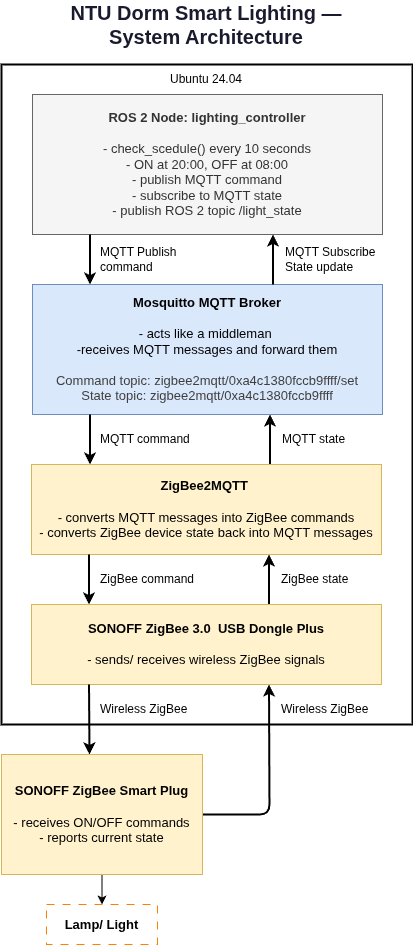
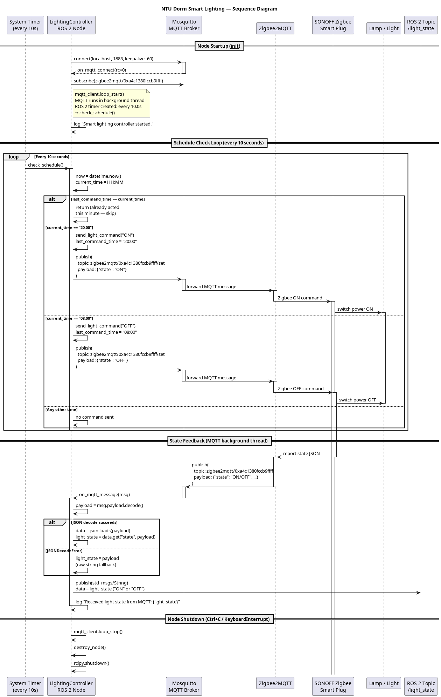

# NTU Dorm Smart Lighting Automation

A ROS 2 (Jazzy) Python package that automates dorm room lighting to reduce electricity waste, turning lights **ON at 8:00 PM** and **OFF at 8:00 AM** via MQTT and Zigbee smart plug.

---

## Table of Contents
 
1. [Overview](#1-overview)
2. [System Architecture](#2-system-architecture)
3. [Technologies Used](#3-technologies-used)
4. [Project Structure](#4-project-structure)
5. [Topics Reference](#5-topics-reference)
6. [Hardware Setup](#6-hardware-setup)
7. [Install Dependencies](#7-install-dependencies)
8. [Running the MQTT Broker](#8-running-the-mqtt-broker)
9. [Running Zigbee2MQTT](#9-running-zigbee2mqtt)
10. [Building the ROS 2 Package](#10-building-the-ros-2-package)
11. [Running the ROS 2 Node](#11-running-the-ros-2-node)
12. [Testing ON/OFF Commands](#12-testing-onoff-commands)
13. [Future Enhancements](#13-future-enhancements)  

---

## 1. Overview

In student dormitories, lights are often left on overnight or during the day, wasting electricity. This project provides a scheduled lighting controller that addresses this by automatically turning lights on and off at fixed times.
 
**The ROS 2 node is responsible for:**
- Checking the current time periodically
- Sending ON/OFF commands to the smart plug via MQTT
- Receiving the current light state from MQTT
- Publishing the current light state to a ROS 2 topic

---

## 2. System Architecture

The diagram below shows how the ROS 2 lighting controller communicates with the ZigBee smart plug through MQTT and Zigbee2MQTT.

<p align="center">
  
</p>

### Sequence Diagram

The sequence diagram shows the flow when the lighting controller sends an ON/OFF command and receives the device state.

<p align="center">
  
</p>

### Component Overview
 
| Component | Layer | Role |
|---|---|---|
| **Scheduler / Timer** | Software | Fires ON/OFF trigger at 8:00 PM / 8:00 AM |
| **ROS 2 Node** | Software | Sends MQTT commands; subscribes to state; publishes `/light_state` |
| **Mosquitto MQTT Broker** | Software | Relays messages between ROS 2 node and Zigbee2MQTT |
| **Zigbee2MQTT** (Docker) | Software | Translates MQTT ↔ Zigbee protocol |
| **SONOFF USB Dongle** | Hardware | Zigbee USB coordinator plugged into laptop |
| **SONOFF Smart Plug** | Hardware | Receives Zigbee ON/OFF command wirelessly |
| **Lamp** | Hardware | Connected to smart plug; physically turns on/off |
 
### Data Flow
 
```
Scheduler (8 PM / 8 AM)
    │  trigger
    ▼
ROS 2 Node  ──── MQTT publish (ON/OFF) ────►  Mosquitto Broker
    ▲                                               │
    │  MQTT subscribe (state JSON)                  │  MQTT bridge
    └───────────────────────────────────────  Zigbee2MQTT (Docker)
                                                    │
                                               Zigbee (USB Dongle)
                                                    │  wireless
                                             SONOFF Smart Plug ──► 💡 Lamp
```
 
**Scheduled behaviour:**
- **8:00 PM** → `ON` command → MQTT → Zigbee2MQTT → Smart plug → Lamp turns on
- **8:00 AM** → `OFF` command → MQTT → Zigbee2MQTT → Smart plug → Lamp turns off
- Smart plug reports state back → ROS 2 node publishes to `/light_state`
---

## 3. Technologies Used

| Category | Tool |
|---|---|
| OS | Ubuntu 24.04 |
| Robot framework | ROS 2 Jazzy |
| Language | Python 3 |
| Messaging | MQTT via Mosquitto |
| Python MQTT library | paho-mqtt |
| Zigbee bridge | Zigbee2MQTT (Docker) |
| Hardware | SONOFF Zigbee 3.0 USB Dongle Plus, SONOFF Zigbee Smart Plug Type G |

---

## 4. Project Structure

```text
ros2_ws/
└── src/
    └── smart_lighting_controller/
        ├── package.xml
        ├── setup.py
        ├── setup.cfg
        ├── resource/
        │   └── smart_lighting_controller
        ├── smart_lighting_controller/
        │   ├── __init__.py
        │   └── lighting_controller.py
        ├── diagrams/
        │   ├── system_archi.drawio
        │   ├── system_archi.png
        │   ├── sequence_archi.uml
        │   └── sequence_archi.png
        ├── test/
        │   ├── test_copyright.py
        │   ├── test_flake8.py
        │   └── test_pep257.py
        ├── README.md
        └── LICENSE
```
---

## 5. Topics Reference

### MQTT Topics
| Purpose | Topic | Message |
|---|---|---|
| Send light command | `zigbee2mqtt/0xa4c1380fccb9ffff/set` | `{"state": "ON"}` / `{"state": "OFF"}` |
| Receive light state | `zigbee2mqtt/0xa4c1380fccb9ffff` | JSON state from Zigbee2MQTT |

### ROS 2 Topics
 
| Purpose | Topic | Message Type |
|---|---|---|
| Publish current light state | `/light_state` | `std_msgs/String` |
 
---

## 6. Hardware Setup

**Required hardware:**
- SONOFF Zigbee 3.0 USB Dongle Plus
- SONOFF Zigbee Smart Plug Type G
- A lamp or light connected to the smart plug

**Setup steps:**
 
1. Plug the SONOFF Zigbee USB Dongle into your laptop.
2. Plug the SONOFF Zigbee Smart Plug into a wall socket, then connect your lamp to the smart plug.
3. Find the dongle path (needed for Zigbee2MQTT configuration):
   ```bash
   ls /dev/serial/by-id/
   ```
4. In the Zigbee2MQTT dashboard, enable **Permit Join**, then hold the button on the smart plug for ~5 seconds until its light starts blinking. The plug will pair automatically.

---

## 7. Install Dependencies

```bash
# Update package list
sudo apt update
 
# Install Mosquitto MQTT broker and client tools
sudo apt install mosquitto mosquitto-clients
 
# Install Python MQTT library
sudo apt install python3-paho-mqtt
 
# Install colcon build tools
sudo apt install python3-colcon-common-extensions
 
# Source ROS 2 Jazzy
source /opt/ros/jazzy/setup.bash
```
 
---

## 8. Running the MQTT Broker
 
Start Mosquitto:
```bash
sudo systemctl start mosquitto
```
 
Verify it is running:
```bash
sudo systemctl status mosquitto
```
 
Mosquitto runs as a system service in the background and will persist across terminals.
 
---

## 9. Running Zigbee2MQTT
 
Navigate to the Zigbee2MQTT folder and start it via Docker:
```bash
cd ~/zigbee2mqtt
sudo docker compose up -d
```
 
Open the Zigbee2MQTT dashboard in your browser:
```
http://localhost:8080
```
 
Zigbee2MQTT runs as a Docker container in the background.
 
---
 
## 10. Building the ROS 2 Package
 
```bash
cd ~/ros2_ws
colcon build --symlink-install
source install/setup.bash
```
 
> Rebuild and re-source whenever you modify the node's code.
 
---
 
## 11. Running the ROS 2 Node
 
Source ROS 2 and the workspace, then run the node:
```bash
source /opt/ros/jazzy/setup.bash
source ~/ros2_ws/install/setup.bash
ros2 run smart_lighting_controller lighting_controller
```
 
**Expected output:**
```
Smart lighting controller started.
Connected to MQTT broker with result code 0.
```
 
---
## 12. Testing ON/OFF Commands
 
### Full System (with hardware)
 
A complete run requires all three components running together:
 
| Step | Command |
|---|---|
| 1. Start Mosquitto | `sudo systemctl start mosquitto` |
| 2. Start Zigbee2MQTT | `cd ~/zigbee2mqtt && sudo docker compose up -d` |
| 3. Run ROS 2 node | `ros2 run smart_lighting_controller lighting_controller` |
 
Then open two more terminals to observe:
 
**Terminal A — watch raw Zigbee2MQTT state:**
```bash
mosquitto_sub -h localhost -t zigbee2mqtt/0xa4c1380fccb9ffff
```
 
**Terminal B — watch ROS 2 topic:**
```bash
source /opt/ros/jazzy/setup.bash
source ~/ros2_ws/install/setup.bash
ros2 topic echo /light_state
```
 
The light will turn ON automatically at 8:00 PM and OFF at 8:00 AM.
 
---
 
### Software-Only (no hardware)
 
The system can also be tested without the physical Zigbee USB dongle or smart plug.
In this mode, Zigbee2MQTT is not required because there is no real Zigbee device connected.

This test checks:
- Whether the ROS 2 node can connect to the MQTT broker
- Whether MQTT state messages can be received by the ROS 2 node
- Whether the ROS 2 node publishes the received state to `/light_state`

**Step 1 — Start Mosquitto and run the ROS 2 node**  
Follow Sections 8, 10, and 11. Skip Section 9 because Zigbee2MQTT requires the physical Zigbee USB dongle.
 
> **What still works without hardware:**
> The ROS 2 node will still fire the scheduled ON/OFF commands at 8:00 PM and 8:00 AM. You can see the `Sent MQTT command` log in the node terminal. However, because there is no smart plug to receive the command and report back, `/light_state` will not update automatically. Use Terminal 3 below to manually simulate the plug's state reply
 
**Step 2 — Open 3 terminals:**
 
**Terminal 1 — Subscribe to Zigbee2MQTT state topic:**
```bash
mosquitto_sub -h localhost -t zigbee2mqtt/0xa4c1380fccb9ffff
```
 
**Terminal 2 — Echo the ROS 2 light state topic:**
```bash
source /opt/ros/jazzy/setup.bash
source ~/ros2_ws/install/setup.bash
ros2 topic echo /light_state
```
 
**Terminal 3 — Simulate a smart plug state update:**
 
Simulate the plug reporting ON:
```bash
mosquitto_pub -h localhost -t zigbee2mqtt/0xa4c1380fccb9ffff -m '{"state": "ON"}'
```
 
Simulate the plug reporting OFF:
```bash
mosquitto_pub -h localhost -t zigbee2mqtt/0xa4c1380fccb9ffff -m '{"state": "OFF"}'
```
 
**Expected result:** Both Terminal 1 and Terminal 2 update immediately.
 
> **Note:** This simulates the *state feedback* path (Zigbee2MQTT → ROS 2). To manually test the MQTT command topic, publish directly to the `/set` topic:
> ```bash
> mosquitto_pub -h localhost -t zigbee2mqtt/0xa4c1380fccb9ffff/set -m '{"state": "ON"}'
> ```
 
---

## 13. Future Enhancements

1. **Sensor Integration**: Add motion or light sensors so the system can react based on room occupancy or brightness.
2. **Manual Override**: Add a ROS 2 service or command to manually turn the light ON/OFF without waiting for the scheduled time.
3. **Configurable Schedule**: Move the ON/OFF timing into a YAML or JSON configuration file instead of hardcoding 8:00 PM and 8:00 AM.
4. **Testing Suite**: Add unit and integration tests to verify MQTT communication and ROS 2 topic publishing.
5. **Docker Support**: Containerize the ROS 2 node for easier setup and deployment.

## License

MIT License - See LICENSE file for details

## Author

Eileen Teoh (eileenteoh10399@gmail.com)